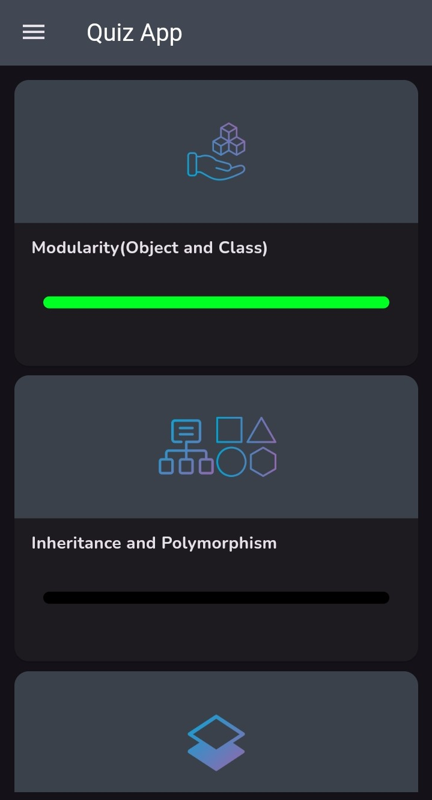

# Java OOP Quiz

Java OOP Quiz App is an interactive mobile app designed to help users test and improve their knowledge of Object-Oriented Programming (OOP) concepts in Java. It features a variety of quizzes that cover essential topics like classes, inheritance, polymorphism, and interfaces, with immediate feedback to enhance learning. The app includes a smooth user interface and progress tracking.

## Screenshots

 

## Contributing
Feel free to fork the project, make improvements, and submit a pull request!

## License
 GPL-3.0
